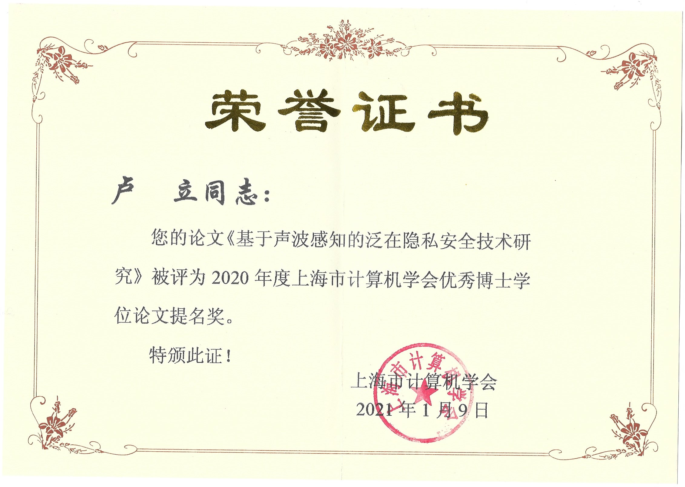
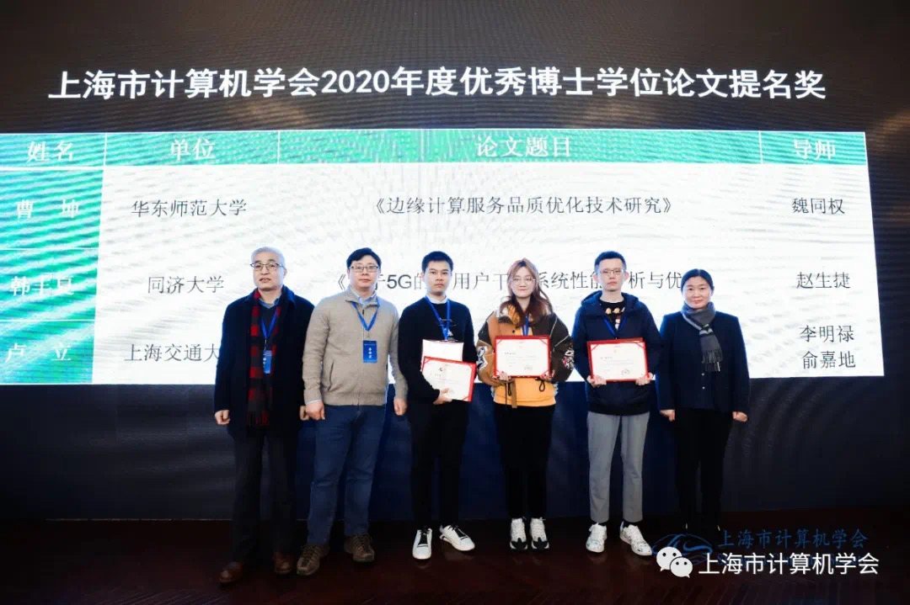
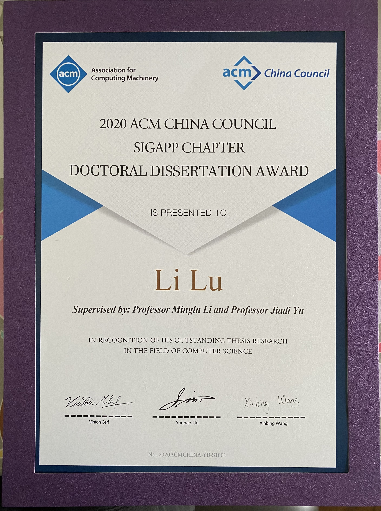
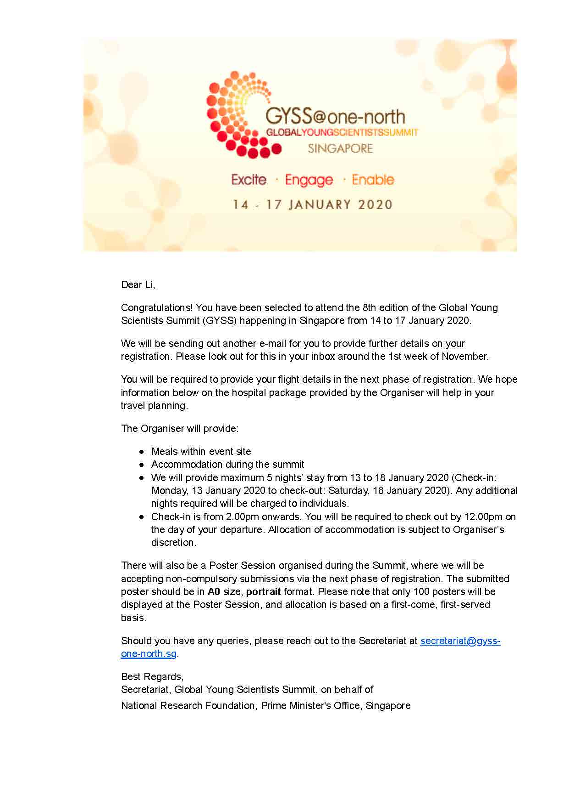
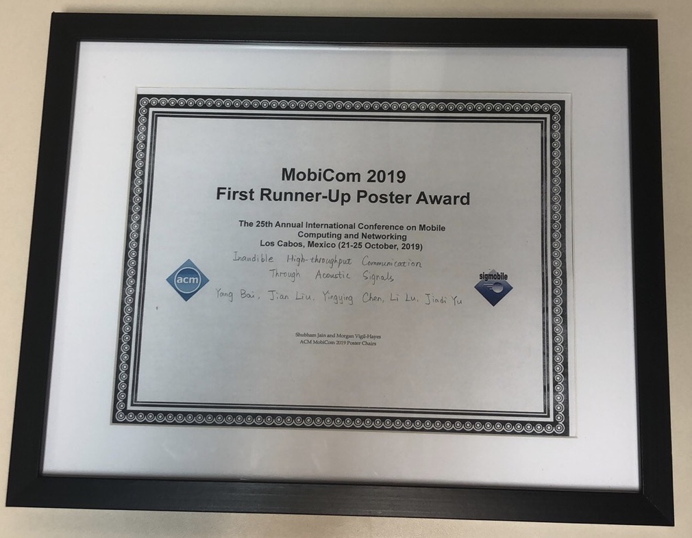
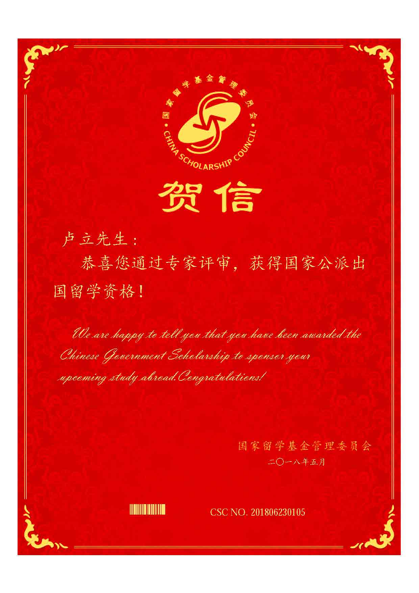

* Shanghai Computer Society Doctoral Dissertaion Award Nominations (上海市计算机学会优秀博士学位论文提名奖)

{:height="40%" width="40%"}
{:height="40%" width="40%"}
* ACM China SIGAPP Chapter Doctoral Dissertation Award

{:height="25%" width="25%"}
* Outstanding Graduate of Shanghai (上海市优秀毕业生)

{:height="25%" width="25%"}
* National Scholarship for Doctoral Students (博士研究生国家奖学金)
* Travel Grant of Global Young Scientists Summit (GYSS) Singapore 2020

{:height="25%" width="25%"}
* First Runner-up Poster Award of ACM MobiCom 2019

{:height="40%" width="40%"}
* National Scholarship for Doctoral Students (博士研究生国家奖学金)
* Joint Ph.D. Training Grant of China Scholarship Council (国家留学基金委联合博士培养资助)

{:height="25%" width="25%"}
* Outstanding Graduate (优秀毕业生)
* National Encouragement Scholarship (国家励志奖学金)
* Lu Shidi 2nd Scholarship (陆诗娣二等奖学金)
* National Encouragement Scholarship (国家励志奖学金)

  
